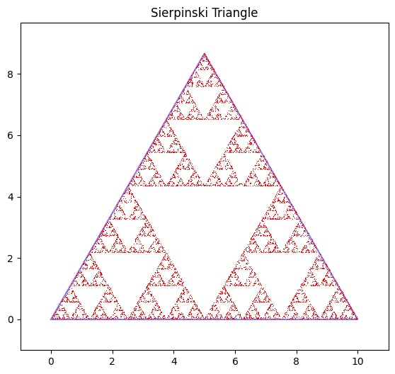

# Sierpinski Triangle Generator

Generates a fractal Sierpinski triangle using the chaos game method.



## Requirements
- Python 3.x
- NumPy
- Matplotlib

## Installation
```bash
pip install -r requirements.txt

## Usage
```bash
python sierpinski.py

## How It Works
1-Creates an equilateral triangle

2-Generates points using barycentric coordinates

3- Applies the chaos game algorithm:

    a- Start from a random point

    b- Repeatedly move halfway toward a random vertex
    